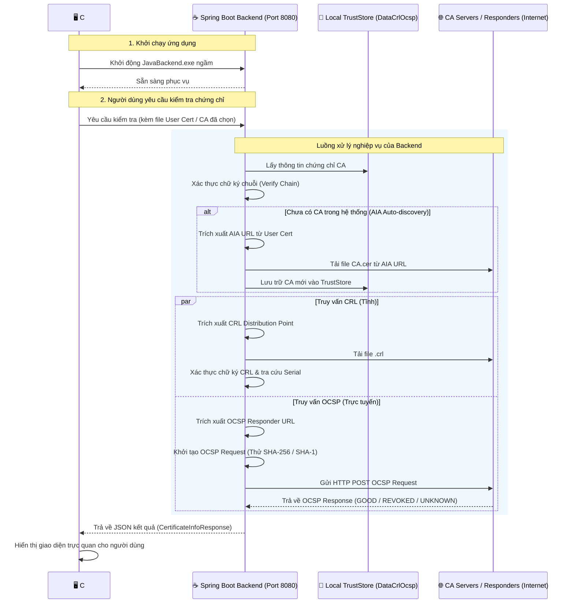

# PKI Certificate Validation Tool (Công cụ kiểm tra trạng thái chứng chỉ số PKI)

Dự án này là một hệ thống hỗ trợ kiểm tra và xác thực trạng thái chứng chỉ số X.509 thời gian thực sử dụng hai phương thức phổ biến là **CRL (Certificate Revocation List)** và **OCSP (Online Certificate Status Protocol)**. Hệ thống bao gồm 2 thành phần chính:
1. **Core Backend (Java Spring Boot)**: Xử lý nghiệp vụ phân tích cấu pháp chứng chỉ số, tải và kiểm tra tệp CRL từ internet, gửi truy vấn OCSP trực tuyến, và quản lý kho lưu trữ CA (TrustStore).
2. **Desktop Frontend (C# Windows Forms)**: Ứng dụng desktop giao diện người dùng, gọi trực tiếp API đến Java Spring Boot Backend chạy ngầm để lấy dữ liệu hiển thị và tối ưu hóa tài nguyên hệ thống.

---

## 📐 Sơ Đồ Kiến Trúc Hoạt Động

Dưới đây là sơ đồ luồng dữ liệu tương tác giữa Client C#, Server Spring Boot và các dịch vụ Certificate Authority (CA) trên Internet:



---

## 🚀 Các Tính Năng Chính

- **Xác thực trạng thái thu hồi**: Kiểm tra trạng thái hoạt động/bị thu hồi của chứng chỉ số qua **CRL (tải danh sách thu hồi trực tuyến)** và **OCSP (truy vấn thời gian thực tới máy chủ Responder)**.
- **Xác thực chuỗi ký số (Chain Verification)**: Sử dụng khóa công khai (Public Key) của chứng chỉ CA tương ứng để đối sánh toán học và kiểm tra xem chứng chỉ User có thực sự được ký bởi CA đó hay không.
- **Tự động nhận diện CA (Auto-discovery / AIA)**: Khi người dùng nạp chứng chỉ User chưa có sẵn CA trong hệ thống, hệ thống tự động bóc tách thông tin mở rộng **AIA (Authority Information Access)** từ chứng chỉ, tự động tải chứng chỉ CA gốc/trung gian từ internet về và thiết lập kho lưu trữ tự động.
- **Quản lý kho TrustStore CA cục bộ**: Thêm mới CA gốc/trung gian, đặt tên nhà cung cấp, kiểm tra hạn dùng của CA, tự động phát hiện lỗi cấu trúc tệp (ví dụ nạp nhầm tệp user làm CA).
- **Tự động quản lý dịch vụ nền**: Ứng dụng Desktop C# tự động tìm kiếm và diệt các tiến trình JavaBackend cũ bị treo từ trước để tránh xung đột cổng (Port 8080), đồng thời khởi chạy và giải phóng dịch vụ nền khỏi RAM khi người dùng tắt Form.

---

## 🛠️ Công Nghệ Sử Dụng

### 1. Backend (`pki-check-tool`)
- **Ngôn ngữ & Framework**: Java 21, Spring Boot 3.3.5.
- **Thư viện mật mã**: **Bouncy Castle (bcprov-jdk18on & bcpkix-jdk18on v1.78)** để xử lý cấu trúc ASN.1 phức tạp trong chứng chỉ số X.509, tạo gói tin OCSP Request và xác thực chữ ký số.
- **Tính năng xử lý**:
  - Hỗ trợ cơ chế thử sai & Fallback thuật toán băm (gửi OCSP qua SHA-256 trước, nếu máy chủ Responder báo lỗi sẽ tự động chuyển đổi sang SHA-1).
  - Trích xuất URL phân phối CRL (OID `2.5.29.31`) và OCSP URL (OID `1.3.6.1.5.5.7.48.1`) trực tiếp từ cấu trúc chứng chỉ.

### 2. Desktop Frontend (`CheckCATool`)
- **Ngôn ngữ & Framework**: C#, Windows Forms (.NET Framework).
- **Thư viện bên thứ ba**: `Newtonsoft.Json` để phân tích gói tin JSON phản hồi từ REST API của Spring Boot.
- **Cơ chế hoạt động**:
  - Khi bật ứng dụng: Chạy ngầm tệp tin `JavaBackend.exe` (được đóng gói từ project Java) tại cổng 8080 mà không làm hiện cửa sổ Command Prompt.
  - Khi tắt ứng dụng: Quét hệ thống và tắt hẳn tiến trình `JavaBackend` để giải phóng RAM của Windows.

---

## 🔌 Tài Liệu API Endpoints (Backend)

Backend Spring Boot cung cấp các REST API sau hoạt động tại cổng mặc định `8080`:

| Phương thức | Endpoint | Tham số | Mô tả |
|---|---|---|---|
| **GET** | `/certificate/list-ca` | Không có | Lấy danh sách các thư mục CA hiện có trong TrustStore. |
| **GET** | `/certificate/ca/{caName}` | `{caName}` (Path Variable) | Lấy danh sách tên file chứng chỉ trong thư mục CA được chỉ định. |
| **POST** | `/certificate/check-by-folder/{caName}` | `{caName}` (Path Variable) | Đối chiếu và xác thực cặp file mặc định `ca.cer` và `user.cer` có sẵn trong thư mục. |
| **POST** | `/certificate/check-temp/{caName}` | `{caName}`, `file` (Multipart file) | Tải lên file User Cert tạm thời để đối sánh thử với CA được chọn. |
| **POST** | `/certificate/save-user/{caName}` | `{caName}`, `file` (Multipart file) | Ghi đè file User Cert đã kiểm tra thành công vào ổ cứng của CA đó. |
| **POST** | `/certificate/validate-new-ca` | `file` (Multipart file) | Kiểm tra xem file tải lên có đúng cấu trúc CA không và có bị trùng lặp không. |
| **POST** | `/certificate/add-new-ca` | `file` (Multipart file), `name` (String) | Tạo thư mục TrustStore mới và lưu tệp `ca.cer` vào hệ thống. |
| **POST** | `/certificate/check-auto` | `file` (Multipart file) | Tự động nhận diện CA bằng cách bóc tách AIA của User Cert tải lên. |

---

## 📊 Cấu Trúc Dữ Liệu Kết Quả JSON
Dữ liệu phản hồi (`CertificateInfoResponse`) trả về cho Client C# có cấu trúc như sau:

```json
{
  "caProvider": "VNPT",
  "subject": "CN=VNPT-CA, O=VNPT, C=VN",
  "issuer": "CN=National Root CA, O=MIC, C=VN",
  "serialNumber": "8c2fe...",
  "validFrom": "01/01/2020 00:00:00",
  "validTo": "31/12/2030 23:59:59",
  "caValidityStatus": "VALID",
  "crlStatus": "VALID",
  "crlValidityStatus": "VALID",
  "ocspStatus": "GOOD",
  "userSubject": "CN=NGUYEN VAN A, UID=MST-010...",
  "userSerialNumber": "1f8b9...",
  "userValidTo": "15/06/2027 18:00:00",
  "certValidityStatus": "VALID"
}
```

### Ý nghĩa một số mã trạng thái đặc biệt:
- **`caValidityStatus` / `certValidityStatus`**:
  - `VALID`: Chứng chỉ đang hoạt động trong thời hạn hiệu lực.
  - `EXPIRED`: Chứng chỉ đã quá hạn sử dụng.
  - `INVALID_CA_FILE_IS_USER`: File `ca.cer` bị nạp nhầm là chứng chỉ người dùng (thiếu quyền CA).
  - `INVALID_USER_FILE_IS_CA`: File `user.cer` bị nạp nhầm là chứng chỉ CA.
- **`ocspStatus`**:
  - `GOOD`: Trạng thái chứng chỉ tốt (chưa bị thu hồi).
  - `REVOKED`: Chứng chỉ đã bị thu hồi bởi CA.
  - `UNAUTHORIZED_BY_CA` (Mã 6): Một số máy chủ OCSP ở Việt Nam chặn truy cập tự do, hệ thống tự động phát hiện để khuyến nghị tham chiếu kết quả từ CRL làm chuẩn.

---

## 📁 Cấu Trúc Thư Mục Dữ Liệu Cục Bộ
Core backend quản lý dữ liệu chứng chỉ thông qua cấu trúc thư mục trong thư mục chạy backend:
```text
DataCrlOcsp/
├── VNPT/
│   ├── ca.cer       # Chứng chỉ nhà cung cấp CA (VNPT)
│   └── user.cer     # Chứng chỉ khách hàng mặc định được đối soát
├── Viettel/
│   ├── ca.cer
│   └── user.cer
└── [Ten_CA_Viet_Tach]/
    ├── ca.cer
    └── user.cer
```

---

## ⚙️ Hướng Dẫn Cài Đặt & Chạy Dự Án

### 📋 Yêu cầu hệ thống
- **Java Development Kit (JDK)**: Phiên bản 21 trở lên.
- **Maven**: Phiên bản 3.8 trở lên.
- **Visual Studio**: Hỗ trợ biên dịch ứng dụng C# .NET Windows Forms.

### 1. Cấu hình & Chạy Backend
1. Di chuyển vào thư mục backend:
   ```bash
   cd pki-check-tool
   ```
2. Chạy ứng dụng Spring Boot:
   ```bash
   mvn spring-boot:run
   ```
   *Backend sẽ khởi chạy tại cổng mặc định `http://localhost:8080`.*
3. Đóng gói thành file chạy nền phục vụ cho ứng dụng Desktop:
   ```bash
   mvn clean package
   ```
   *File `.jar` được tạo trong thư mục `target`. Bạn có thể sử dụng Launch4j hoặc các công cụ tương đương để chuyển đổi file `.jar` thành file `JavaBackend.exe` chạy độc lập trên Windows.*

### 2. Khởi chạy Ứng dụng Desktop C#
1. Mở file `CheckCATool.sln` bằng Visual Studio.
2. Thực hiện Build Solution.
3. Sao chép tệp `JavaBackend.exe` (được đóng gói từ bước 1) và thư mục dữ liệu `DataCrlOcsp` vào cùng thư mục đầu ra của tệp thực thi C# (ví dụ: `CheckCATool/bin/Debug/` hoặc `CheckCATool/bin/Release/`).
4. Khởi chạy file thực thi `CheckCATool.exe`.

---

## 📖 Hướng Dẫn Sử Dụng Hệ Thống

### Chế độ 1: Kiểm tra chứng chỉ hệ thống mặc định
- Chọn nhà cung cấp CA từ danh sách thả xuống trên ứng dụng.
- Nhấn nút **Kiểm tra**.
- Hệ thống sẽ tự đối chiếu cặp file `ca.cer` và `user.cer` có sẵn trong thư mục tương ứng trên bộ nhớ vật lý của server backend.

### Chế độ 2: Kiểm tra chứng chỉ User mới nạp
- Chọn nhà cung cấp CA muốn đối sánh trên giao diện.
- Chọn nút tải lên tệp chứng chỉ User mới của bạn (`.cer` hoặc `.crt`).
- Hệ thống thực hiện kiểm tra chữ ký liên kết và trạng thái trực tuyến.
- Nếu chứng chỉ hợp lệ, hệ thống hiển thị kết quả và hiển thị thông báo hỏi xem bạn có muốn áp dụng và lưu đè file này thành chứng chỉ User mặc định (`user.cer`) cho CA đó hay không.

### Chế độ 3: Tự động nhận diện CA (Auto-discovery)
- Chọn tùy chọn **Tự động nhận diện CA (AIA)** từ danh sách CA.
- Tải lên tệp chứng chỉ User cần kiểm tra.
- Hệ thống tự động phân tích chứng chỉ để tìm URL AIA, tải chứng chỉ CA tương ứng từ internet về và thiết lập thư mục lưu trữ mới cho CA này.

---

## 🛡️ Các Chốt Chặn Bảo Mật & Ràng Buộc Dữ Liệu
Để phòng tránh lỗi cấu trúc tệp dữ liệu, hệ thống đã cài đặt sẵn các chốt chặn nghiệp vụ sau:
1. **Chặn nạp sai vai trò CA**: File CA nạp lên hệ thống bắt buộc phải có quyền CA (`Basic Constraints != -1`). Nếu người dùng cố tình đổi tên tệp user thành `ca.cer` để nạp, backend sẽ trả về lỗi `INVALID_CA_FILE_IS_USER`.
2. **Chặn nạp sai vai trò User**: File User nạp lên không được phép mang quyền CA (`Basic Constraints == -1`). Tránh trường hợp nạp nhầm file CA làm chứng chỉ người dùng.
3. **Xác thực chữ ký số chuỗi (Verify Chain)**: Khi nạp tệp User mới khớp với CA, backend sẽ thực hiện giải mã chữ ký số của User bằng Public Key của CA. Nếu chữ ký không trùng khớp, hệ thống từ chối nạp và đưa ra cảnh báo không tương thích.
4. **Phòng tránh lỗi OCSP Responder bị chặn**: Một số máy chủ OCSP của các nhà cung cấp Việt Nam chặn truy vấn tự do (trả lỗi Unauthorized/Status 6). Hệ thống sẽ tự động phát hiện, hiển thị chú thích khuyến cáo người dùng tham chiếu kết quả từ CRL làm chuẩn.
